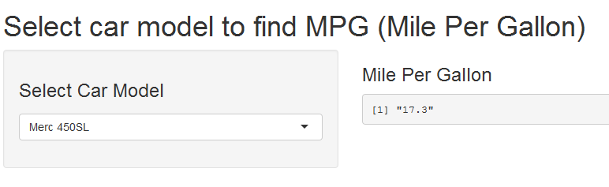

## Car MPG overview


CarMpg is a simple shiny app. :<br/>
The user can select a car model from a drop down, then app will display the mpg (mile per gallon) for the selected car:<br/>

The data for CarMpg app is based on mtcars dataset whcih is available in R.

---

## Data source

The data was extracted from the 1974 Motor Trend US magazine, and comprises fuel consumption and 10 aspects of automobile design and performance for 32 automobiles (1973-74 models).

Here is an example for the mtcars dataset: <br/>

```r
head(mtcars)
```

```
##                    mpg cyl disp  hp drat    wt  qsec vs am gear carb
## Mazda RX4         21.0   6  160 110 3.90 2.620 16.46  0  1    4    4
## Mazda RX4 Wag     21.0   6  160 110 3.90 2.875 17.02  0  1    4    4
## Datsun 710        22.8   4  108  93 3.85 2.320 18.61  1  1    4    1
## Hornet 4 Drive    21.4   6  258 110 3.08 3.215 19.44  1  0    3    1
## Hornet Sportabout 18.7   8  360 175 3.15 3.440 17.02  0  0    3    2
## Valiant           18.1   6  225 105 2.76 3.460 20.22  1  0    3    1
```

For more details check the mtcars data set description here: <br/>
https://stat.ethz.ch/R-manual/R-devel/library/datasets/html/mtcars.html

---
## How to Use Car MPG

Using Car MPG is straightforward:<br/>

Select the car model from the dropdown on the left side , and it will display the milage per gallon for the selected car in the right side



---

## Get application


car MPG application is avaliable here :<br/>

https://hamode23.shinyapps.io/CarMpg/
